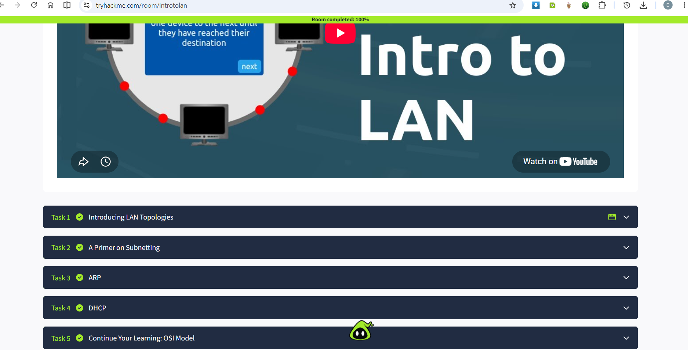
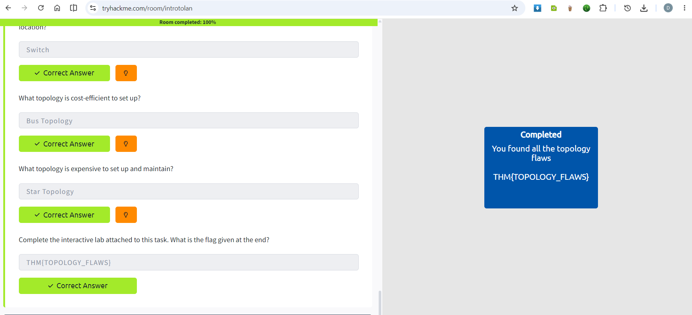
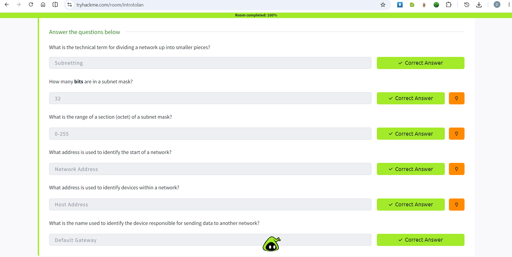
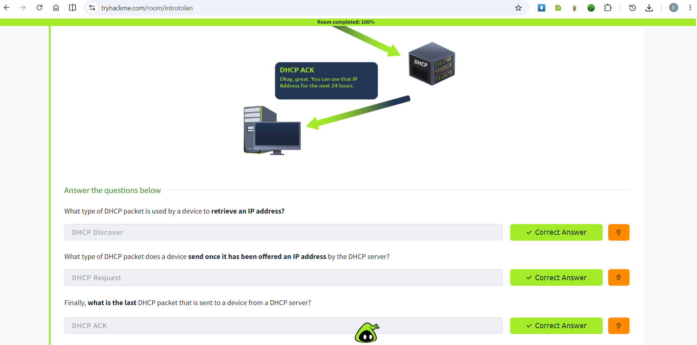
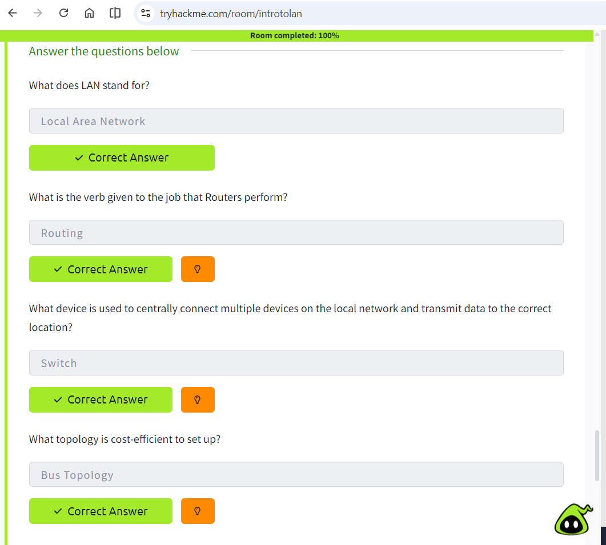
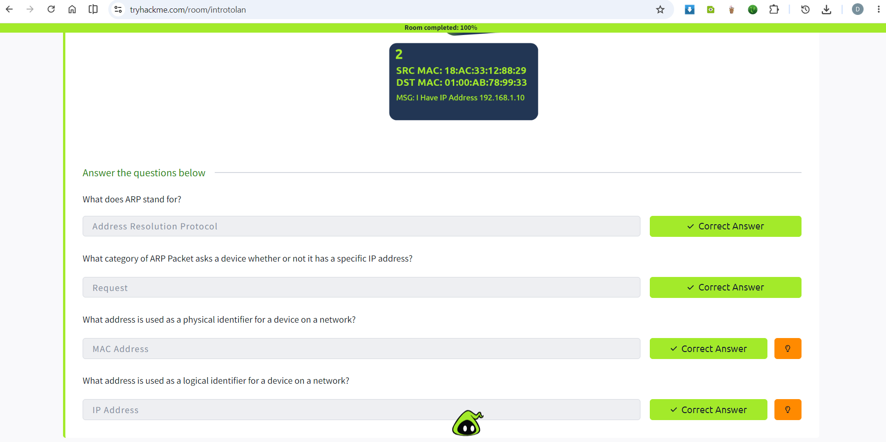

# Intro to LAN

## Room Information

- Platform: TryHackMe

- Difficulty: Easy

- Category: Networking

## Learning Objectives

- Learn what a LAN is and LAN Topologies

- Understand switches and routers

- Understand Subnneting

- Understand ARP and DHCP

## Key Concepts

### Local Area Network

A LAN connects computers within a limited geographical area such as:

- Home
- School
- Office

### LAN Topologies

- Bus Topology: cost-efficient to set up

- Star Topology: expensive to set up and maintain

- Ring Topology: less prone to bottlenecks

### Switch

A switch connects multiple devices within a LAN.

Functions:

- Learns MAC addresses

- Sends traffic only to the destination device

### Router

Routers connect different networks together.

Example:  Home LAN to Internet

### MAC Address

A MAC address is the hardware address of a network interface.

Example:  00:1A:2B:3C:4D:5E

### Subnetting

Subnetting is the term given to splitting up a network into smaller, miniature networks within itself.

Subnets use IP addresses in three different ways:

- Identify the network address

- Identify the host address

- Identify the default gateway

### ARP

- Address Resolution Protocol or ARP, is the technology that is responsible for allowing devices to identify themselves on a network.

- ARP allows a device to associate its MAC address with an IP address on the network.

- In order to map IP address and MAC address, ARP sends two types of messages:  ARP Request  and ARP Reply

### DHCP

-  DHCP (Dynamic Host Configuration Protocol) allows to assign IP addresses automatically.

## Practical Exercise

I practiced the various ways in which LAN Toplogies are vulnerable to breaking. 

By Breaking the LAN topologies I retrieved the flag.

## Key Takeaways

- Switches operate inside LANs.

- Routers connect different networks.

- Every network interface has a MAC address.

- Devices can use ARP to find the MAC address (and therefore the physical identifier) of a device for communication.

## Lessons Learned

- Introducing LAN Topologies

- A Primer on Subnetting

- ARP

- DHCP

## Screenshots

