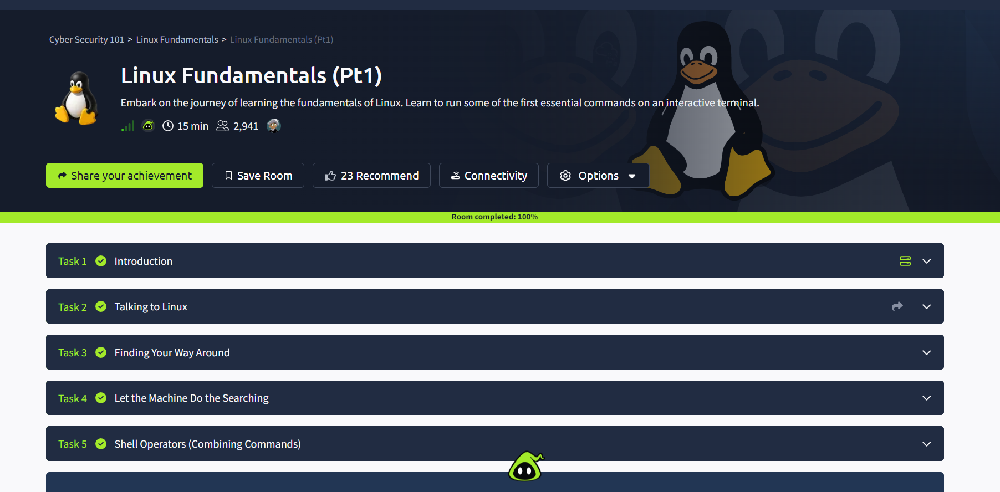
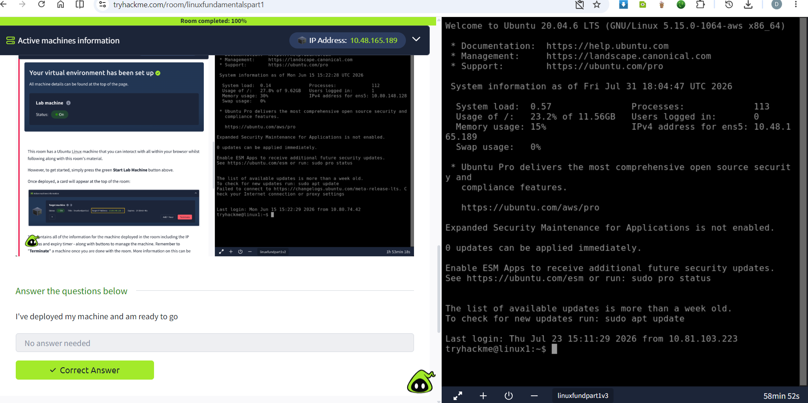
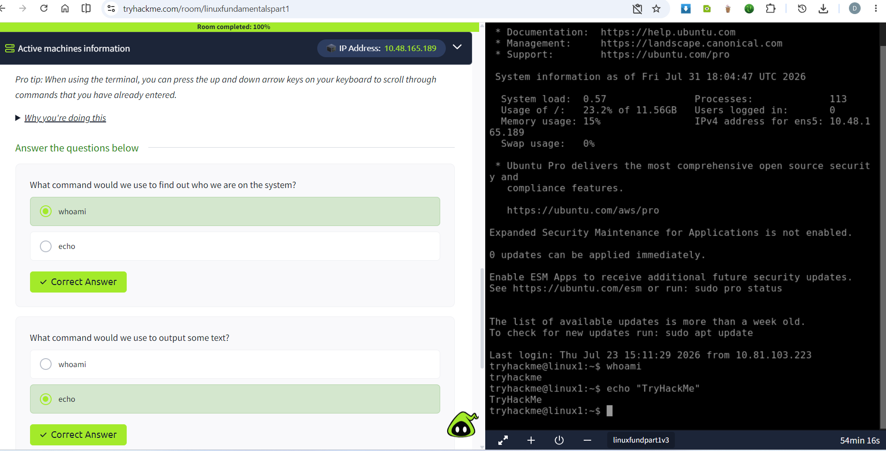
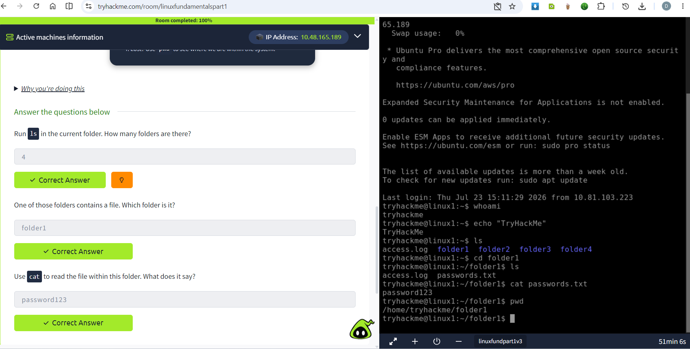
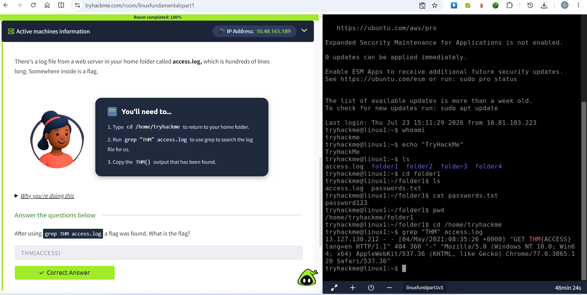
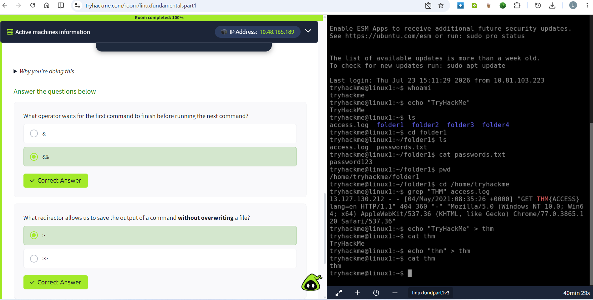

# Linux Fundamentals

## Room Information

- Platform: TryHackMe

- Difficulty: Easy

- Category: Linux

## Learning Objectives

- Deploying our first Linux machine

- Use the whoami command to see who you are on the system.

- use echo to output a text

- Using commmon commands in Linux

- Combine commands and capture their output

## Commands Practiced

### pwd

Displays current directory.

### ls

Lists files.

### cd

Changes directory.

### echo 

outputs a text

### grep 

searches the log file

## Practical Exercises

Completed exercises involving:

- use the whoami command to see who we are on the system

- use echo to output the text TryHackMe

- Run ls to see what's in your home folder.

- Use cd to change folder.  use ls again to see what files are now in the folder we've entered.

- Use cat to output the contents of any file.

- Use pwd to see where we are within the system.

- use grep to search the log file for us.

## Key Takeaways

- Linux is a popular choice for servers and the machines that we'll interact within cyber security.

- A command is an instruction that we can give the computer to perform a given task

- We can use a set of Linux commands to help us efficiently search for and through files.

- In Linux, there are a set of special characters that can combine commands together.

## Lessons Learned

- Introduction to Linux

- Talking to Linux

- Finding Your Way Around

- Let the Machine Do the Searching

- Shell Operators (Combining Commands)

## Screenshots

